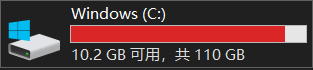

# user-data-scaner

find out which folder or file is too large in AppData folder on Windows.

## why

one day i found my C drive is like this:



then i use some sort of disk cleaner software to clean my c drive，but it didn't help.

finally i think about the AppData folder. AppData is a hidden folder located in `C:\Users\<username>\AppData`. The AppData folder contains custom settings and other information needed by applications.

but if you want to find which folder or file is large in AppData folder, you have to manually check the folder properties. and there are thousands of files in it.

this is why i create this tool.

## develop

```bash
# local development
npm run start

# Build for ia32
npm run pack:32

# Build for x64
npm run pack:64
```